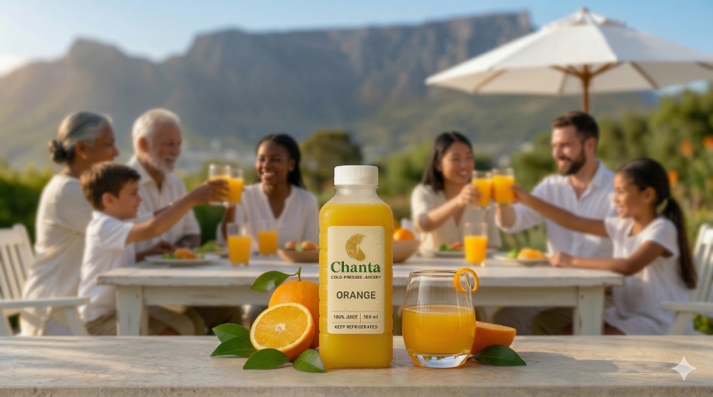
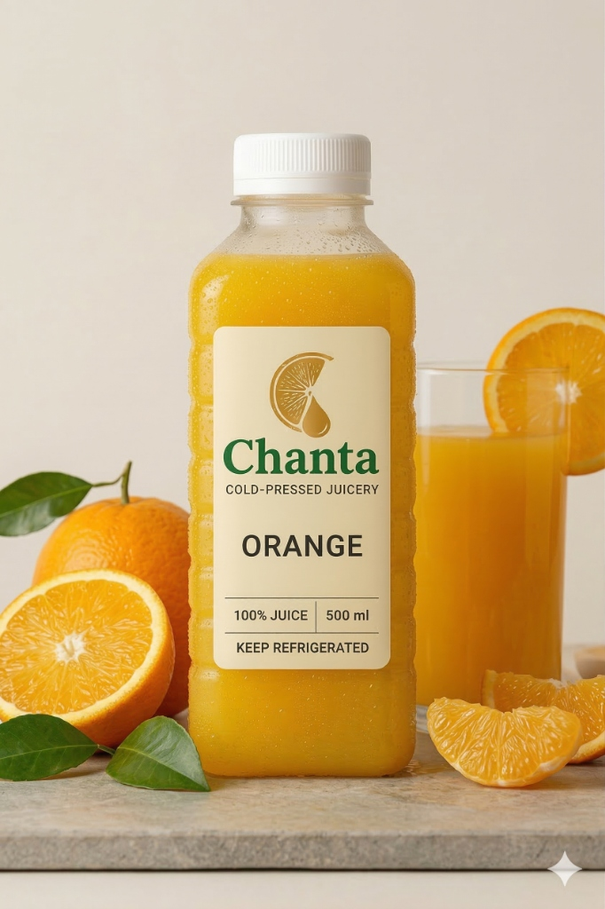

# Chanta Store Index (Test Version)

This file contains the current working code for the Chanta Landing Page & Store (`index-store-test.html`), including the layered horizontal scroll architecture and delivery calculator logic.

```html
<!DOCTYPE html>
<html lang="en">
<head>
    <meta charset="UTF-8">
    <meta name="viewport" content="width=device-width, initial-scale=1.0">
    <title>Chanta | Cold-Pressed Organic Orange Juice</title>
    
    <!-- Font Awesome -->
    <link rel="stylesheet" href="https://cdnjs.cloudflare.com/ajax/libs/font-awesome/6.4.0/css/all.min.css">
    
    <!-- Tailwind CSS -->
    <script src="https://cdn.tailwindcss.com"></script>
    <script>
        tailwind.config = {
            theme: {
                extend: {
                    colors: {
                        brand: {
                            gold: '#D4AF37',     // The juice
                            forest: '#2A3B24',   // The leaves
                            sage: '#E8EAE3',     // Light background
                            charcoal: '#242424', // Typography
                            stone: '#D9D9D9'     // Neutral accents
                        }
                    },
                    fontFamily: {
                        sans: ['"General Sans"', 'system-ui', 'sans-serif'],
                    }
                }
            }
        }
    </script>

    <!-- General Sans Font -->
    <link href="https://api.fontshare.com/v2/css?f[]=general-sans@200,300,400,500,600,700&display=swap" rel="stylesheet">

    <!-- GSAP & ScrollTrigger -->
    <script src="https://cdnjs.cloudflare.com/ajax/libs/gsap/3.12.2/gsap.min.js"></script>
    <script src="https://cdnjs.cloudflare.com/ajax/libs/gsap/3.12.2/ScrollTrigger.min.js"></script>
    
    <!-- Lenis Smooth Scroll -->
    <script src="https://cdn.jsdelivr.net/gh/studio-freight/lenis@1.0.19/bundled/lenis.min.js"></script>

    <style>
        :root {
            --curve: cubic-bezier(0.85, 0, 0.15, 1);
        }

        body {
            background-color: #FDFCF8;
            color: #242424;
            overflow-x: hidden;
            font-family: 'General Sans', sans-serif;
            background-image: 
                radial-gradient(circle at 100% 100%, rgba(212, 175, 55, 0.05) 0%, transparent 50%),
                radial-gradient(circle at 0% 0%, rgba(42, 59, 36, 0.03) 0%, transparent 40%);
            margin: 0;
            padding: 0;
        }

        ::selection {
            background: #D4AF37;
            color: white;
        }

        /* Hero Outro / Intro */
        #intro {
            height: 100vh;
            width: 100vw;
            position: fixed;
            top: 0;
            left: 0;
            z-index: 20;
            display: flex;
            align-items: center;
            justify-content: center;
            background: #FDFCF8;
        }

        .hero-image {
            width: 40vw;
            height: auto;
            max-width: 800px;
            object-fit: contain;
            filter: drop-shadow(0 30px 40px rgba(0,0,0,0.15));
        }

        /* Scroll Indication line */
        .scroll-indicator {
            position: absolute;
            bottom: 3vh;
            left: 50%;
            transform: translateX(-50%);
            display: flex;
            flex-direction: column;
            align-items: center;
            gap: 1rem;
            color: #D4AF37;
            font-size: 0.75rem;
            font-weight: 600;
            letter-spacing: 0.2em;
            text-transform: uppercase;
        }

        .scroll-line {
            width: 1px;
            height: 8vh;
            background: rgba(212, 175, 55, 0.3);
            position: relative;
            overflow: hidden;
        }

        .scroll-line::after {
            content: '';
            position: absolute;
            top: 0;
            left: 0;
            width: 100%;
            height: 50%;
            background: #D4AF37;
            animation: scrollLineDrop 2s cubic-bezier(0.77, 0, 0.175, 1) infinite;
        }

        @keyframes scrollLineDrop {
            0% { transform: translateY(-100%); }
            100% { transform: translateY(200%); }
        }

        /* Ticker */
        .ticker-wrapper {
            width: 100%;
            height: 100vh;
            display: flex;
            align-items: center;
            overflow: hidden;
            position: fixed;
            top: 0;
            left: 0;
            z-index: 10;
            pointer-events: none;
            opacity: 0;
        }

        .ticker-container {
            display: flex;
            white-space: nowrap;
            align-items: center;
            padding-left: 50vw;
            padding-right: 10vw;
            height: 100vh;
        }

        .word-box, .logo-box {
            display: inline-flex;
            align-items: center;
            margin-right: clamp(1rem, 4vw, 3rem);
            transition: color 0.5s ease;
        }

        .ticker-text-block {
            display: flex;
            align-items: center;
            font-size: clamp(3rem, 12vw, 12rem);
            font-weight: 700;
            line-height: 0.9;
            text-transform: uppercase;
            letter-spacing: -0.04em;
        }

        .juice-logo {
            height: 0.75em;
            width: auto;
            display: block;
            pointer-events: none;
            filter: brightness(0); /* Make the white logo charcoal */
        }

        /* Bundles in Ticker */
        .bundles-section {
            display: inline-flex;
            gap: 2rem;
            margin-left: 15vw;
            align-items: center;
            pointer-events: auto; /* Re-enable clicking inside the ticker */
            opacity: 0; /* Animated in with GSAP */
        }
        
        /* Layer 3 Modal Overrides */
        .custom-scrollbar::-webkit-scrollbar {
            width: 6px;
        }
        .custom-scrollbar::-webkit-scrollbar-track {
            background: rgba(0,0,0,0.05);
        }
        .custom-scrollbar::-webkit-scrollbar-thumb {
            background: rgba(0,0,0,0.2);
            border-radius: 10px;
        }
        
        #operating-room-overlay {
            pointer-events: auto;
        }
        #operating-room-panel {
            pointer-events: auto;
            color: #242424; /* override dark body text */
        }

        /* Fixed Footer */
        .hud-footer {
            position: fixed;
            bottom: 2rem;
            left: 2rem;
            z-index: 100;
            display: flex;
            gap: 2rem;
            pointer-events: auto;
        }
        
        .hud-footer a {
            font-size: 0.8rem;
            font-weight: 600;
            text-transform: uppercase;
            letter-spacing: 0.2em;
            color: rgba(36, 36, 36, 0.4);
            text-decoration: none;
            transition: color 0.3s ease;
        }

        .hud-footer a:hover {
            color: rgba(36, 36, 36, 1);
        }
    </style>
</head>

<body>
    <!-- Scroll spacer dynamically synced to horizontal length for 1:1 scrolling -->
    <div id="scroll-spacer"></div>

    <!-- 1. INTRO HERO -->
    <section id="intro">
        
        <div class="scroll-indicator">
            <span>Discover</span>
            <div class="scroll-line"></div>
        </div>
    </section>

    <!-- 2. LAYER 1 & 2 (HORIZONTAL FLOW) -->
    <div class="ticker-wrapper" id="ticker-wrap">
        <div class="ticker-container" id="ticker">
            
            <!-- LAYER 1: THE SURFACE -->
            <div class="ticker-text-block">
                <div class="word-box">When</div>
                <div class="word-box">life</div>
                <div class="word-box">gives</div>
                <div class="word-box">you</div>
                <div class="logo-box"></div>
                <div class="word-box">oranges...</div>
                <div class="word-box">Drink</div>
                <div class="word-box">Chanta.</div>
                
                <div class="word-box" style="margin-left: 10vw;">Nothing</div>
                <div class="word-box">added.</div>
                <div class="logo-box"></div>
                <div class="word-box">Nothing</div>
                <div class="word-box">taken</div>
                <div class="word-box">away.</div>
                <div class="word-box">Just</div>
                <div class="word-box" id="word-pure">pure,</div>
                <div class="word-box">cold-pressed</div>
                <div class="word-box" id="word-sunshine">sunshine</div>
                <div class="word-box">delivered</div>
                <div class="word-box">to</div>
                <div class="word-box">your</div>
                <div class="word-box" id="word-door">door.</div>
            </div>

            <!-- LAYER 2: THE WORKING SURFACE -->
            <div class="bundles-section" id="bundles-layer">
                <!-- Select Bundle Title (Vertical stacked text to look cool horizontal) -->
                <div class="mx-6 lg:mx-8 shrink-0 flex flex-col items-end opacity-50">
                    <span class="text-sm tracking-widest uppercase mb-4 text-brand-gold">Step Two</span>
                    <h2 class="text-5xl lg:text-6xl font-bold text-right italic font-light">Choose<br>Your<br>Bundle</h2>
                </div>

                <!-- Bundle 1 -->
                <div class="w-[310px] lg:w-[330px] shrink-0 bg-white shadow-xl shadow-brand-charcoal/5 border border-brand-charcoal/5 rounded-[2.5rem] overflow-hidden flex flex-col hover:-translate-y-2 transition-transform duration-500 whitespace-normal">
                    <div class="w-full h-48 overflow-hidden">
                        
                    </div>
                    <div class="p-8">
                        <span class="text-[10px] font-bold uppercase tracking-widest text-brand-gold mb-2 block">Independent Bundle</span>
                        <h3 class="text-3xl font-bold mb-2">12 Bottles</h3>
                        <div class="text-4xl font-bold mb-1">R 399</div>
                        <ul class="space-y-3 text-sm text-brand-charcoal/70 mb-8 mt-6">
                            <li class="flex gap-2"><i class="fa-solid fa-check text-brand-gold mt-0.5"></i>Free delivery within 4km</li>
                        </ul>
                        <button onclick="selectBundle(0)" class="w-full py-4 bg-white text-brand-charcoal rounded-full font-bold hover:bg-brand-gold hover:text-white transition-colors">Configure & Checkout</button>
                    </div>
                </div>

                <!-- Bundle 2 -->
                <div class="w-[310px] lg:w-[330px] shrink-0 bg-brand-charcoal border-2 border-brand-gold rounded-[2.5rem] overflow-hidden flex flex-col hover:-translate-y-2 transition-transform duration-500 whitespace-normal relative z-10 scale-105">
                    <div class="w-full h-48 overflow-hidden relative">
                        
                        <div class="absolute top-4 right-4 bg-brand-gold text-white text-[10px] font-bold uppercase tracking-widest px-3 py-1 rounded-full">Most Popular</div>
                    </div>
                    <div class="p-8">
                        <span class="text-[10px] font-bold uppercase tracking-widest text-brand-gold mb-2 block">Family Bundle</span>
                        <h3 class="text-3xl font-bold mb-2 text-white">24 Bottles</h3>
                        <div class="text-4xl font-bold mb-1 text-white">R 589</div>
                        <ul class="space-y-3 text-sm text-white/70 mb-8 mt-6">
                            <li class="flex gap-2"><i class="fa-solid fa-check text-brand-gold mt-0.5"></i>Free delivery within 4km</li>
                        </ul>
                        <button onclick="selectBundle(1)" class="w-full py-4 bg-brand-gold text-white rounded-full font-bold hover:bg-white hover:text-brand-charcoal transition-colors shadow-lg shadow-brand-gold/20">Configure & Checkout</button>
                    </div>
                </div>

                <!-- Bundle 3 -->
                <div class="w-[310px] lg:w-[330px] shrink-0 bg-white shadow-xl shadow-brand-charcoal/5 border border-brand-charcoal/5 rounded-[2.5rem] overflow-hidden flex flex-col hover:-translate-y-2 transition-transform duration-500 whitespace-normal">
                    <div class="w-full h-48 overflow-hidden">
                        
                    </div>
                    <div class="p-8">
                        <span class="text-[10px] font-bold uppercase tracking-widest text-brand-gold mb-2 block">Community Bundle</span>
                        <h3 class="text-3xl font-bold mb-2">54 Bottles</h3>
                        <div class="text-4xl font-bold mb-1">R 1,729</div>
                        <ul class="space-y-3 text-sm text-brand-charcoal/70 mb-8 mt-6">
                            <li class="flex gap-2"><i class="fa-solid fa-check text-brand-gold mt-0.5"></i>Free delivery within 4km</li>
                        </ul>
                        <button onclick="selectBundle(2)" class="w-full py-4 bg-white text-brand-charcoal rounded-full font-bold hover:bg-brand-gold hover:text-white transition-colors">Configure & Checkout</button>
                    </div>
                </div>
            </div>

        </div>
    </div>


    <!-- 3. LAYER 3: THE OPERATING ROOM -->
    <div id="operating-room-overlay" onclick="closeOperatingRoom()" class="fixed inset-0 bg-[#FDFCF8]/90 backdrop-blur-md z-[80] hidden opacity-0 transition-opacity duration-300 pointer-events-none"></div>
            
    <div id="operating-room-panel" class="whitespace-normal fixed top-0 right-0 w-full max-w-xl h-full bg-white z-[90] shadow-2xl flex flex-col transform translate-x-full transition-transform duration-500 ease-in-out">
        <div class="p-8 border-b border-gray-50 flex justify-between items-center sticky top-0 bg-white z-10">
            <div>
                <h3 class="text-2xl font-bold italic">Configure Order</h3>
                <p class="text-xs font-bold uppercase tracking-widest text-gray-400 mt-1">Delivery details & payment</p>
            </div>
            <button onclick="closeOperatingRoom()" class="w-12 h-12 rounded-full bg-brand-stone/40 flex items-center justify-center text-brand-charcoal hover:bg-brand-charcoal hover:text-white transition-all">
                <i class="fa-solid fa-xmark text-xl"></i>
            </button>
        </div>
        
        <div class="flex-grow overflow-y-auto overscroll-contain p-8 custom-scrollbar" data-lenis-prevent="true">
            <div id="order-form" class="w-full">
                <div class="space-y-6">
                    <!-- Selected Bundle Display -->
                    <div class="bg-brand-sage/30 rounded-2xl p-6 border border-brand-charcoal/5">
                        <div class="flex justify-between items-start mb-4">
                            <div>
                                <h4 id="selected-bundle-name" class="font-bold text-lg">Bundle Name</h4>
                                <p id="selected-bundle-desc" class="text-sm text-brand-charcoal/60">Description</p>
                            </div>
                            <span id="selected-bundle-price" class="font-bold text-xl">R 0</span>
                        </div>
                    </div>

                    <!-- Delivery Information -->
                    <div>
                        <label class="block text-sm font-bold uppercase tracking-widest text-brand-gold mb-3">Delivery Address</label>
                        <textarea id="order-address" rows="3" class="w-full p-4 bg-white border border-gray-200 rounded-xl focus:ring-2 focus:ring-brand-gold focus:border-transparent transition-all resize-none" placeholder="Enter your full street address..."></textarea>
                    </div>

                    <!-- Delivery Settings -->
                    <div class="grid grid-cols-2 gap-4">
                        <button onclick="setDeliveryType('standard')" id="btn-standard" class="p-4 border-2 border-brand-gold bg-brand-gold/5 rounded-xl text-left transition-all">
                            <span class="block text-sm font-bold mb-1">Standard</span>
                            <span class="block text-xs text-brand-charcoal/60">Day after tomorrow</span>
                        </button>
                        <button onclick="setDeliveryType('sameday')" id="btn-sameday" class="p-4 border-2 border-transparent bg-gray-50 rounded-xl text-left transition-all hover:bg-gray-100">
                            <span class="block text-sm font-bold mb-1">Same-Day</span>
                            <span class="block text-xs text-brand-charcoal/60">R25 / km</span>
                        </button>
                    </div>

                    <!-- Map / Validation Notice -->
                    <div id="delivery-result" class="hidden bg-gray-50 rounded-xl p-4 text-sm">
                        <div class="flex justify-between items-center mb-2">
                            <span class="text-gray-500">Distance</span>
                            <span id="delivery-distance" class="font-mono font-bold">-- km</span>
                        </div>
                        <div class="flex justify-between items-center pt-2 border-t border-gray-200">
                            <span class="font-bold">Estimated Delivery</span>
                            <span id="delivery-cost" class="font-mono font-bold text-brand-gold">R --</span>
                        </div>
                        <p id="delivery-time-note" class="text-xs text-brand-charcoal/50 text-center mt-3 font-semibold"></p>
                    </div>

                    <button id="calc-delivery-btn" onclick="calculateDelivery()" class="w-full py-3 bg-gray-100 text-brand-charcoal rounded-xl font-bold hover:bg-gray-200 transition-colors text-sm">
                        <i class="fa-solid fa-location-dot mr-2"></i> Calculate Delivery Cost
                    </button>
                </div>
            </div>
        </div>

        <!-- Checkout Buttons -->
        <div class="p-8 border-t border-gray-100 bg-white" id="checkout-btns">
            <div class="space-y-3">
                <button onclick="checkoutBundleYoco()" class="w-full py-4 bg-brand-charcoal text-white rounded-xl font-bold hover:bg-black transition-colors flex items-center justify-center gap-2">
                    <i class="fa-solid fa-credit-card"></i> Pay Online Now
                </button>
                <button onclick="checkoutBundleWhatsApp()" class="w-full py-4 bg-[#25D366] text-white rounded-xl font-bold hover:bg-[#128C7E] transition-colors flex items-center justify-center gap-2 shadow-lg shadow-[#25D366]/20">
                    <i class="fa-brands fa-whatsapp text-xl"></i> Order via WhatsApp
                </button>
                <p class="text-[10px] text-center text-gray-400 uppercase tracking-widest mt-2">WhatsApp orders payable via Cash/EFT</p>
            </div>
        </div>
    </div>

    <script>
        // ─── DATA & STATE ─────────────────────────────────────────────
        const WHATSAPP_NUMBER = '27608189675';
        const YOCO_BASE_URL = 'https://pay.yoco.com/chanta';
        
        // Using Mapbox coords for Rosebank Mall
        const STORE_COORDS = { lat: -26.1459, lon: 28.0416 }; 

        const BUNDLES = [
            { name: "Independent Bundle", size: "12 Bottles", price: 399 },
            { name: "Family Bundle", size: "24 Bottles", price: 589 },
            { name: "Community Bundle", size: "54 Bottles", price: 1729 }
        ];

        let selectedBundle = 0;
        let deliveryType = 'standard';
        let calculatedDistance = 0;
        let calculatedDeliveryCost = 0;

        // ─── LOGIC ────────────────────────────────────────────────────
        function selectBundle(index) {
            selectedBundle = index;
            const b = BUNDLES[index];
            
            document.getElementById('selected-bundle-name').textContent = b.name;
            document.getElementById('selected-bundle-desc').textContent = b.size;
            document.getElementById('selected-bundle-price').textContent = `R ${b.price}`;
            
            // Reset delivery state visually
            document.getElementById('delivery-result').classList.add('hidden');
            calculatedDistance = 0;
            calculatedDeliveryCost = 0;
            const btn = document.getElementById('calc-delivery-btn');
            btn.innerHTML = '<i class="fa-solid fa-location-dot"></i> Calculate Delivery Cost';
            btn.classList.remove('bg-brand-sage', 'text-brand-forest');
            
            openOperatingRoom();
        }

        function setDeliveryType(type) {
            deliveryType = type;
            document.getElementById('btn-standard').className = 
                type === 'standard' 
                ? 'p-4 border-2 border-brand-gold bg-brand-gold/5 rounded-xl text-left transition-all'
                : 'p-4 border-2 border-transparent bg-gray-50 rounded-xl text-left transition-all hover:bg-gray-100';
                
            document.getElementById('btn-sameday').className = 
                type === 'sameday' 
                ? 'p-4 border-2 border-brand-gold bg-brand-gold/5 rounded-xl text-left transition-all'
                : 'p-4 border-2 border-transparent bg-gray-50 rounded-xl text-left transition-all hover:bg-gray-100';

            // Recalculate if we already have a distance
            if(calculatedDistance > 0) {
                calculateDelivery(true);
            }
        }

        // Haversine formula
        function calculateDistance(lat1, lon1, lat2, lon2) {
            const R = 6371; 
            const dLat = (lat2 - lat1) * Math.PI / 180;
            const dLon = (lon2 - lon1) * Math.PI / 180;
            const a = 
                Math.sin(dLat/2) * Math.sin(dLat/2) +
                Math.cos(lat1 * Math.PI / 180) * Math.cos(lat2 * Math.PI / 180) * 
                Math.sin(dLon/2) * Math.sin(dLon/2);
            const c = 2 * Math.atan2(Math.sqrt(a), Math.sqrt(1-a));
            return R * c; 
        }

        function calcDeliveryCost(km, bundleIndex, type) {
            if (type === 'sameday') return Math.round(km * 25);
            
            // First 4km are entirely free
            if (km <= 4) return 0;
            
            // Base rate: R12/km on the distance beyond the free 4km, up to 15km total distance
            if (km <= 15) return Math.round((km - 4) * 12);
            
            // Tier 2: Over 15km total
            // This charges 11km (from 4km to 15km) at R12, and the remainder at R16
            return Math.round((11 * 12) + ((km - 15) * 16));
        }

        async function calculateDelivery(isRecalc = false) {
            const address = document.getElementById('order-address').value;
            if (!address && !isRecalc) {
                alert('Please enter an address first');
                return;
            }

            const btn = document.getElementById('calc-delivery-btn');
            
            if (!isRecalc) {
                btn.innerHTML = '<i class="fa-solid fa-spinner fa-spin"></i> Calculating...';
                btn.disabled = true;
            }

            try {
                if (!isRecalc) {
                    // Use Nominatim (OpenStreetMap) for free geocoding
                    const response = await fetch(`https://nominatim.openstreetmap.org/search?format=json&q=${encodeURIComponent(address + ', Johannesburg, South Africa')}`);
                    const data = await response.json();

                    if (data && data.length > 0) {
                        const destLat = parseFloat(data[0].lat);
                        const destLon = parseFloat(data[0].lon);
                        calculatedDistance = calculateDistance(STORE_COORDS.lat, STORE_COORDS.lon, destLat, destLon);
                    } else {
                        throw new Error("Address not found. We assumed Johannesburg area. Please be more specific.");
                    }
                }

                calculatedDeliveryCost = calcDeliveryCost(calculatedDistance, selectedBundle, deliveryType);

                document.getElementById('delivery-distance').textContent = `${calculatedDistance.toFixed(1)} km`;
                document.getElementById('delivery-cost').textContent = calculatedDeliveryCost === 0 ? 'FREE' : `R ${calculatedDeliveryCost}`;
                
                // Calculate ETA logic
                const days = ['Sunday','Monday','Tuesday','Wednesday','Thursday','Friday','Saturday'];
                const d = new Date();
                d.setDate(d.getDate() + 2);
                const dayStr = days[d.getDay()];

                if (deliveryType === 'sameday') {
                    document.getElementById('delivery-time-note').textContent = `Speedy Delivery: Within 4 hours`;
                } else {
                    document.getElementById('delivery-time-note').textContent = `Estimated delivery: ${dayStr}`;
                }

                btn.innerHTML = '<i class="fa-solid fa-check"></i> Calculated';
                btn.classList.add('bg-brand-sage', 'text-brand-forest');
                btn.disabled = false;

                document.getElementById('delivery-result').classList.remove('hidden');
                document.getElementById('checkout-btns').classList.remove('hidden');

            } catch (e) {
                alert('Could not calculate delivery. Please try again.');
                btn.innerHTML = '<i class="fa-solid fa-location-dot"></i> Calculate Delivery Cost';
                btn.disabled = false;
            }
        }

        function checkoutBundleWhatsApp() {
            const address = document.getElementById('order-address').value.trim();
            const b = BUNDLES[selectedBundle];
            const total = b.price + calculatedDeliveryCost;
            const deliveryNote = calculatedDeliveryCost === 0 ? 'FREE' : `R ${calculatedDeliveryCost}`;
            const typeLabel = deliveryType === 'sameday' ? 'Same-Day' : 'Day After Tomorrow';

            const message = 
                `🍊 *CHANTA STORE ORDER* 🍊\n\n` +
                `*Bundle:* ${b.name}\n` +
                `*Bundle Price:* R ${b.price}\n` +
                `*Delivery:* ${deliveryNote} (${calculatedDistance.toFixed(1)}km, ${typeLabel})\n` +
                `*TOTAL:* R ${total.toFixed(2)}\n\n` +
                `*Address:* ${address}\n\n` +
                `Payment will be made via Cash or EFT.\n` +
                `Awaiting refreshment! 🍊`;

            window.open(`https://wa.me/${WHATSAPP_NUMBER}?text=${encodeURIComponent(message)}`, '_blank');
        }

        function checkoutBundleYoco() {
            const b = BUNDLES[selectedBundle];
            const total = b.price + calculatedDeliveryCost;
            window.open(`${YOCO_BASE_URL}?amount=${total}`, '_blank');
        }

        function openOperatingRoom() {
            const overlay = document.getElementById('operating-room-overlay');
            const panel = document.getElementById('operating-room-panel');
            
            overlay.classList.remove('hidden');
            setTimeout(() => {
                overlay.classList.remove('opacity-0');
                overlay.classList.add('opacity-100', 'pointer-events-auto');
                overlay.classList.remove('pointer-events-none');
                
                panel.classList.remove('translate-x-full');
                panel.classList.add('translate-x-0');
            }, 10);
            
            // Critical for Layer 3: Disable Layer 1/2 lenis horizontal scroll
            lenis.stop();
        }

        function closeOperatingRoom() {
            const overlay = document.getElementById('operating-room-overlay');
            const panel = document.getElementById('operating-room-panel');
            
            overlay.classList.remove('opacity-100', 'pointer-events-auto');
            overlay.classList.add('opacity-0', 'pointer-events-none');
            
            panel.classList.remove('translate-x-0');
            panel.classList.add('translate-x-full');
            
            setTimeout(() => {
                overlay.classList.add('hidden');
                lenis.start();
            }, 300);
        }
        // ─── SCROLL TRACK CALCULATION ───────────────
        function updateSpacer() {
            const bundles = document.querySelector('#bundles-layer');
            if(bundles) {
                // Determine the exact horizontal pixel length of the track
                const paddingRight = window.innerWidth > 1024 ? window.innerWidth * 0.1 : window.innerWidth * 0.05;
                const rightEdge = bundles.offsetLeft + bundles.offsetWidth + paddingRight;
                
                // Multiply track length by 2 to slow down scrolling speed so it feels luxurious, not too fast
                document.getElementById('scroll-spacer').style.height = (rightEdge * 2 + window.innerHeight) + 'px';
            }
        }
        updateSpacer();
        window.addEventListener('resize', updateSpacer);
        
        document.fonts.ready.then(() => {
            updateSpacer();
            ScrollTrigger.refresh();
        });

        // ─── GSAP ─────────────────────────────────────────────────────
        gsap.registerPlugin(ScrollTrigger);

        const lenis = new Lenis({ lerp: 0.1, wheelMultiplier: 1.2, smoothWheel: true });
        lenis.on('scroll', ScrollTrigger.update);
        gsap.ticker.add((time) => lenis.raf(time * 1000));
        gsap.ticker.lagSmoothing(0);

        const tl = gsap.timeline({
            scrollTrigger: {
                trigger: "body",
                start: "top top",
                end: "bottom bottom",
                scrub: true,
                invalidateOnRefresh: true,
                onUpdate: (self) => {
                    if (self.progress === 0 && lenis.progress > 0) {
                        ScrollTrigger.refresh();
                    }
                }
            }
        });

        // 1. Hero out (fade out image and text) - INDEPENDENT SCROLL TRIGGER
        // This ensures the hero fades instantly within the first 600px of scrolling,
        // rather than being stretched across the massive 10,000px+ horizontal timeline.
        gsap.to("#intro", {
            opacity: 0,
            scale: 1.05,
            pointerEvents: "none",
            ease: "none",
            scrollTrigger: {
                trigger: "body",
                start: "top top",
                end: "+=600",
                scrub: true,
                onLeave: () => gsap.set("#intro", { display: "none" }),
                onEnterBack: () => gsap.set("#intro", { display: "flex" })
            }
        });

        // 2. Ticker in & allow pointer events
        tl.to("#ticker-wrap", { opacity: 1, pointerEvents: "auto", duration: 0.2 }, 0);

        // 3. Horizontal scroll movement
        // We move the entire #ticker container horizontally based on its width.
        const ticker = document.querySelector('#ticker');
        
        // Use a function to recalculate the distance dynamically if resized
        const getScrollAmount = () => {
            const bundles = document.querySelector('#bundles-layer');
            const ticker = document.querySelector('#ticker');
            
            // Safeguard: Ensure the right edge of the last block doesn't bleed off screen.
            // Give extra padding on the right to prevent clipping the outer shadow on narrow screens and ensure "Choose Your Bundle" stays framed.
            // Increased to 20% on desktop, 12% on mobile
            const paddingRight = window.innerWidth > 1024 ? window.innerWidth * 0.2 : window.innerWidth * 0.12;
            const bundlesRightEdge = bundles.offsetLeft + bundles.offsetWidth;
            const maxScroll = bundlesRightEdge - window.innerWidth + paddingRight;

            return -maxScroll;
        };

        const tween = gsap.to("#ticker", {
            x: () => getScrollAmount(),
            ease: "none",
            duration: 20
        });

        tl.add(tween, "tickerStart");

        // 4. Word staggering (Removed for horizontal optimization)
        // Words are now permanently visible on the ticker to prevent re-paints.

        // 5. Color Pulse
        // Pulse purely when passing horizontally
        tl.to("#word-pure", { color: "#D4AF37",  ease: "sine.inOut", duration: 1.5 }, "tickerStart+=8");
        tl.to("#word-sunshine", { color: "#D4AF37", ease: "sine.inOut", duration: 1.5 }, "tickerStart+=9.5");

        // 6. Reveal Bundles Section as we arrive
        tl.to("#bundles-layer", { opacity: 1, duration: 2 }, "tickerStart+=12");

        window.addEventListener('resize', () => ScrollTrigger.refresh());
    </script>
</body>
</html>
```
